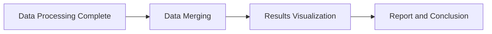
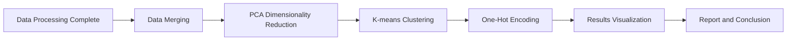

# Learning Platform "Study Bar" Data Mining Report

### Team Name: Research Home
### Topic: Overview of Overall and Grouped Learning Performance of Elementary School Students (Grades 1-6) on Study Bar

> Authors: 

---

[TOC]

---

## 1. Topic Description

### (1) Problems Encountered

With the advancement of technology, more and more schools are integrating online learning platforms to assist students in their studies. Study Bar is one such online learning platform. But how significant is its impact on student learning?

- Study Bar data lacks organization, making it difficult to identify overall trends or user habits.
- The data does not include user grade levels or gender.
- Existing data fields may not effectively link usage patterns with learning outcomes.

### (2) Solutions

By further processing and analyzing user learning data from the Study Bar platform, we aim to uncover insights that cannot be obtained from scattered data, identifying different user needs for online learning platforms.

- Visualizing overall data to observe its characteristics.
- Grouping data by different months, grade levels, or gender.
- Using machine clustering to segment users based on behavior and explore differences between clusters.

## 2. Motivation

By implementing various data processing and analysis techniques, we aim to discover hidden valuable information from data mining.

- Help teachers understand when and how students use the platform to optimize course adjustments.
- Gain insights into student willingness to use the platform and how they leverage it for learning.
- Provide new perspectives for developers to enhance personalization and user experience on the learning platform.

## 3. Data Preparation and Processing

### Field Descriptions

The data comes from six separate CSV files, consisting of five months of Study Bar platform learning records and a student information table. We first concatenate the Study Bar data and then use an inner join on the common `Student ID` field to merge student data.

Here is a description of the cleaned CSV fields:

| Field Name       | Description                      | Example Value            |
|-----------------|---------------------------------|-------------------------|
| `stuid`         | Unique student identifier       | 164999                  |
| `gender`        | Student gender                  | Male / Female           |
| `birth`         | Date of birth                    | 1970-01-01 00:00:00     |
| `online_time`   | Total accumulated online time (seconds) | 25821.0                |
| `material_time` | Total material usage time (seconds) | 4874.0                 |
| `course_name`   | Course name for the month      | "112 Academic Year English Homework" |
| `video_time`    | Video browsing time (seconds)  | 2274.0                  |
| `total_video_time` | Total video watching time (seconds) | 4823.0              |
| `quiz_time`     | Quiz time spent (seconds)      | 0.0                      |
| `total_quiz_time` | Total quiz time (seconds)     | 24.0                     |
| `speech_time`   | Speech assignment time (seconds) | 0.0                     |
| `total_speech_time` | Total speech assignment time (seconds) | 0.0             |
| `audio_time`    | Audio file usage time (seconds) | 0.0                     |
| `total_audio_time` | Total audio usage time (seconds) | 0.0                   |
| `month`         | Data recorded month            | 2                        |
| `grade`         | Student grade level (inferred from birthdate) | 1 |
| `courseCategory` | Course category based on course name | English |

To facilitate visualization, the data was further aggregated by grouping by `stuid`:

| Field Name       | Description                      | Example Value            |
|-----------------|---------------------------------|-------------------------|
| `stuid`         | Unique student identifier       | 164999                  |
| `gender`        | Student gender                  | Male / Female           |
| `birth`         | Date of birth                    | 1970-01-01 00:00:00     |
| `online_time`   | Accumulated online time (Feb–Jun) | 25821.0                |
| `material_time` | Total material usage time (Feb–Jun) | 4874.0             |
| `course_name`   | Course names from Feb–Jun (list) | ["112 Academic Year English Homework"] |
| `video_time`    | Video browsing time (Feb–Jun)  | 2274.0                  |
| `total_video_time` | Total video watching time (Feb–Jun) | 4823.0          |
| `quiz_time`     | Quiz time spent (Feb–Jun)      | 0.0                      |
| `total_quiz_time` | Total quiz time (Feb–Jun)     | 24.0                     |
| `speech_time`   | Speech assignment time (Feb–Jun) | 0.0                     |
| `total_speech_time` | Total speech assignment time (Feb–Jun) | 0.0         |
| `audio_time`    | Audio file usage time (Feb–Jun) | 0.0                     |
| `total_audio_time` | Total audio usage time (Feb–Jun) | 0.0                   |

## 4. Analysis Methods and Process

Since Study Bar is mainly an elementary school learning platform, our analysis focuses on elementary students.

### Data Processing Steps

1. **Data Loading**: Load datasets, including student information and multiple months of learning behavior data, clean missing values, and convert time fields into seconds.
2. **Data Cleaning and Transformation**: Process null values and compute completion rates (e.g., video and speech completion rates).
3. **Data Merging**: Combine monthly datasets, group by `stuid`, and sum up learning time for each student.
4. **Data Overview and Analysis**: Use Python visualization tools (e.g., line charts, bar charts, heatmaps) to analyze the data.

### Clustering Analysis

1. **PCA (Principal Component Analysis)**: Reduces multidimensional data into principal components to simplify structure and improve visualization.
2. **K-means Clustering**: Groups students based on learning behavior similarities.
3. **One-Hot Encoding**: Converts categorical data into numerical format for analysis.
4. **Results Visualization**: Displays clustering results using 2D scatter plots.

## 5. Initial Results and Expected Benefits

### (1) Overall Student Learning Analysis

#### (1) Total Material Usage Time per Course

1. **Observations**:
   - Some courses have significantly higher material usage times.
   - Heatmaps show that courses like "Reading Together" and "Faithful Reading" have noticeably higher engagement.

2. **Key Takeaways**:
   - Courses with specific and structured content encourage students to develop habitual learning patterns.

### (2) Grade and Gender Differences in Learning Behavior

<iframe src="https://data-mining-strong-beignet.netlify.app/2-1-4.html" height="500px" frameborder="0"></iframe>

| Grade | Material Type | Avg Time (s) | Std Dev (s) | Min Time (s) | Max Time (s) | Median Time (s) | Sample Size |
|---|---|---|---|---|---|---|---|
| 1 | Quiz Time | 5.72 | 34.33 | 0.00 | 206.00 | 0.00 | 36 |
| 1 | Video Time | 74.72 | 172.95 | 0.00 | 739.00 | 0.00 | 36 |
...
